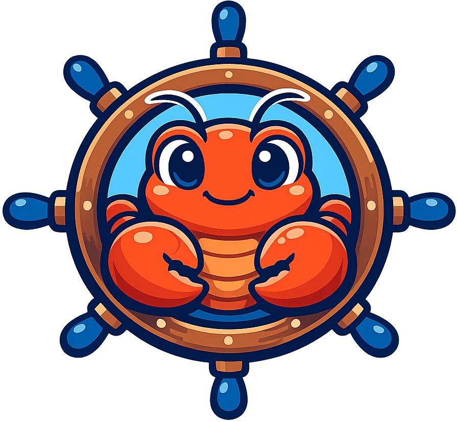
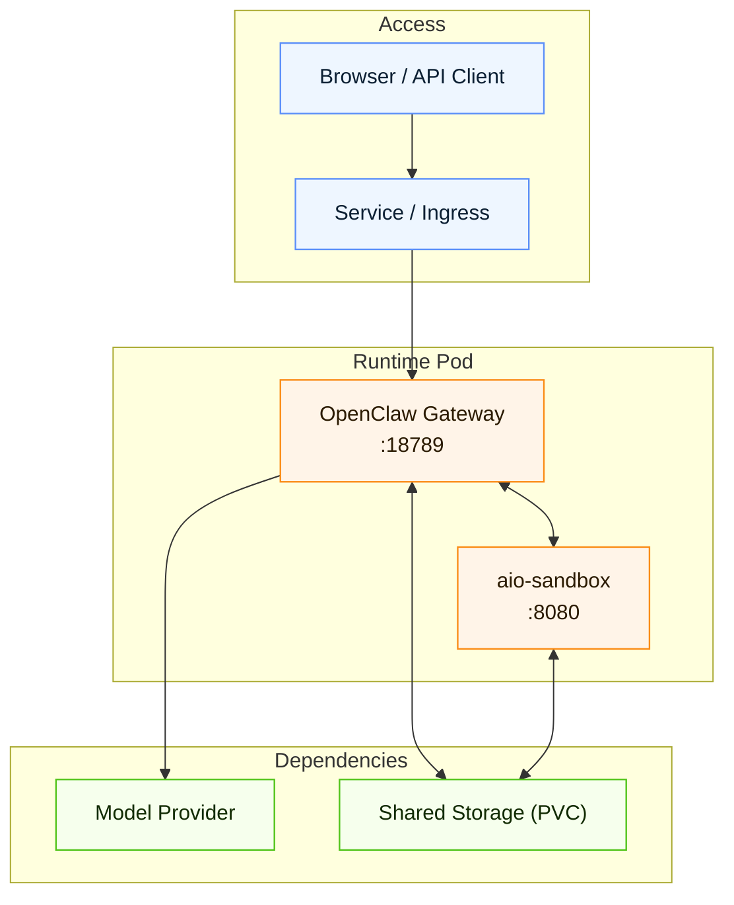

<p align="center">
  
</p>
<h1 align="center" style="margin-top: 4px;">openclaw-helm</h1>

<p align="center">
  Helm packaging for OpenClaw on Kubernetes.
  Focused on practical security controls and flexible model/provider configuration.
</p>

<p align="center">
  <a href="https://artifacthub.io/packages/helm/openclaw-helm-chart/openclaw"></a>
  <a href="https://github.com/weak-fox/openclaw-helm/actions/workflows/helm-ci.yaml"></a>
  <a href="https://github.com/weak-fox/openclaw-helm/actions/workflows/chart-release.yaml"></a>
  <a href="./LICENSE"></a>
  <a href="https://weak-fox.github.io/openclaw-helm"></a>
  <a href="https://github.com/weak-fox/openclaw-helm"></a>
  <a href="https://github.com/openclaw/openclaw"></a>
  <a href="https://kubernetes.io/"></a>
  <a href="https://helm.sh/"></a>
</p>

<p align="center">
  <a href="#quick-start">Quick Start</a> •
  <a href="#examples">Examples</a> •
  <a href="#compatibility">Compatibility</a> •
  <a href="#architecture">Architecture</a> •
  <a href="#browser-workflow-demo">Demo</a> •
  <a href="#repository-layout">Repo Layout</a> •
  <a href="#artifact-hub">Artifact Hub</a> •
  <a href="#references-and-integrations">References</a>
</p>

## Highlights

- Flexible model/provider setup with clear keys (`provider` / `api` / `baseUrl` / `model`).
- Security switches exposed through `gateway.controlUi` for different deployment policies.
- Integrated `aio-sandbox` with shared workspace storage:
  browser actions are visible, workspace config can be updated through browser flows, and shell/Jupyter tasks run in the same runtime.
- Built-in offline seed bootstrap for skills/plugins via [`weak-fox/openclaw-offline-seed`](https://github.com/weak-fox/openclaw-offline-seed),
  so startup can use pre-bundled artifacts without runtime `npx` downloads.
- Unified image registry prefixing through `global.imageRegistry`.
- CI/release workflows included for linting, templating, and chart publishing.

## Compatibility

| Item | Version |
| --- | --- |
| Chart | `1.0.0` |
| OpenClaw app | `2026.2.26` |
| Kubernetes | `>=1.24.0-0` |
| Helm | `v3.x` |

Source of truth: `charts/openclaw/Chart.yaml`.

## Architecture



## Quick start

`OPENCLAW_API_KEY` is the unified runtime provider key consumed by OpenClaw provider config.
Put your provider key in this secret (OpenAI / Anthropic / LiteLLM / OpenRouter / vLLM gateway / Ollama gateway, etc.).

Create namespace and API key secret first (required):

```bash
kubectl create namespace openclaw
kubectl -n openclaw create secret generic openclaw-api-key \
  --from-literal=OPENCLAW_API_KEY=sk-xxxx
```

Install directly from local chart path (test profile):

```bash
helm upgrade --install openclaw ./charts/openclaw -n openclaw \
  --set gateway.controlUi.allowInsecureAuth=true \
  --set gateway.controlUi.dangerouslyDisableDeviceAuth=true \
  --set gateway.controlUi.dangerouslyAllowHostHeaderOriginFallback=true
```

Install from Helm repository (test profile):

```bash
helm repo add openclaw-helm https://weak-fox.github.io/openclaw-helm
helm repo update
helm upgrade --install openclaw openclaw-helm/openclaw -n openclaw \
  --set gateway.controlUi.allowInsecureAuth=true \
  --set gateway.controlUi.dangerouslyDisableDeviceAuth=true \
  --set gateway.controlUi.dangerouslyAllowHostHeaderOriginFallback=true
```

> Warning
> The three `gateway.controlUi.*` flags above reduce security and are for local testing only.
> For production/security-sensitive deployments, follow OpenClaw official guidance:
> https://docs.openclaw.ai/gateway/security

Full values and operations guide: [charts/openclaw/README.md](charts/openclaw/README.md)

## Examples

All example values are here: [charts/openclaw/examples](charts/openclaw/examples)

Example usage:

```bash
helm upgrade --install openclaw ./charts/openclaw -n openclaw \
  -f ./charts/openclaw/examples/<example-file>.yaml
```

## Browser workflow demo

Captured from a real Kubernetes deployment with LiteLLM (`Qwen3`) backend, using `aio-sandbox` and shared storage to drive browser operations and workspace-level execution.


## Repository layout

- Chart source: [charts/openclaw](charts/openclaw)
- Chart docs: [charts/openclaw/README.md](charts/openclaw/README.md)
- License: [LICENSE](LICENSE)
- Third-party notices: [THIRD_PARTY_NOTICES.md](THIRD_PARTY_NOTICES.md)
- Workflows:
  - [helm-ci.yaml](.github/workflows/helm-ci.yaml)
  - [chart-release.yaml](.github/workflows/chart-release.yaml)
  - [sync-openclaw-release.yaml](.github/workflows/sync-openclaw-release.yaml)

## Publishing chart repo

Enable GitHub Pages on `gh-pages` (root).  
When chart-related changes are pushed to `main` (or a GitHub Release is published), `chart-release.yaml` runs `helm/chart-releaser-action` to publish:

- GitHub Release assets (`.tgz`)
- Helm repo index (`gh-pages/index.yaml`)

Then clients can install/update by:

```bash
helm repo add openclaw-helm https://weak-fox.github.io/openclaw-helm
helm repo update
```

## Artifact Hub

This repo is prepared for Artifact Hub onboarding.

1. Publish chart index on GitHub Pages (`https://weak-fox.github.io/openclaw-helm/index.yaml`).
2. Register the Helm repo in Artifact Hub (repository URL above).
3. After Artifact Hub creates your repository entry, add root metadata file `artifacthub-repo.yml`.
4. Keep the metadata file synced to `gh-pages` so Artifact Hub can read it from the chart repository root.

## References and integrations

- Integrated sandbox runtime: [`agent-infra/sandbox`](https://github.com/agent-infra/sandbox)
- Offline seed image project: [`weak-fox/openclaw-offline-seed`](https://github.com/weak-fox/openclaw-offline-seed)
- Referenced Helm implementation patterns: [`serhanekicii/openclaw-helm`](https://github.com/serhanekicii/openclaw-helm)

For attribution and license details of referenced/derived parts, see [THIRD_PARTY_NOTICES.md](THIRD_PARTY_NOTICES.md).
